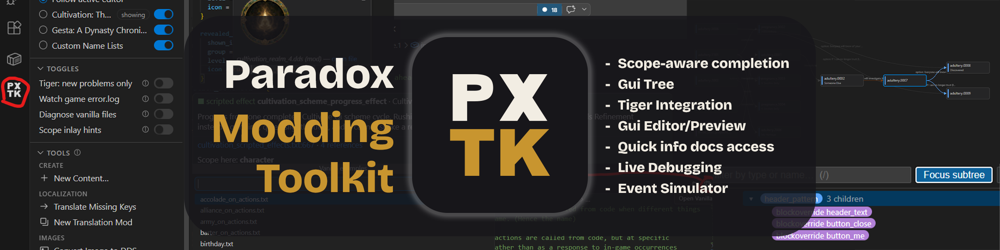
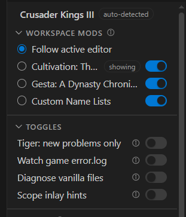
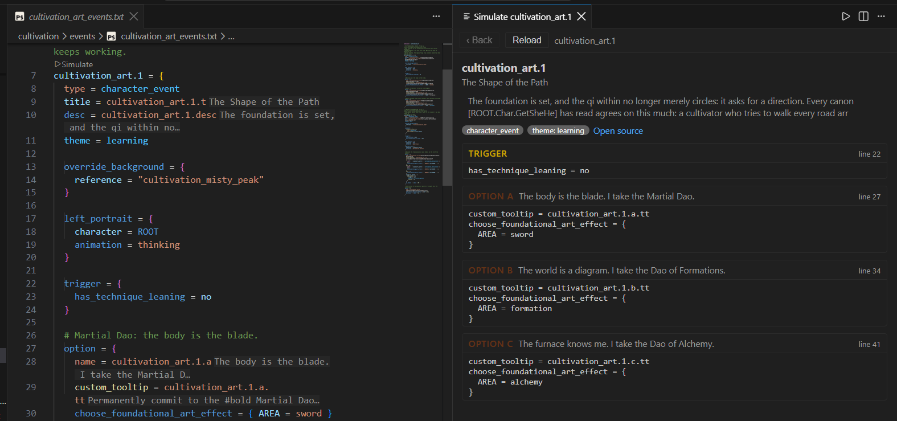
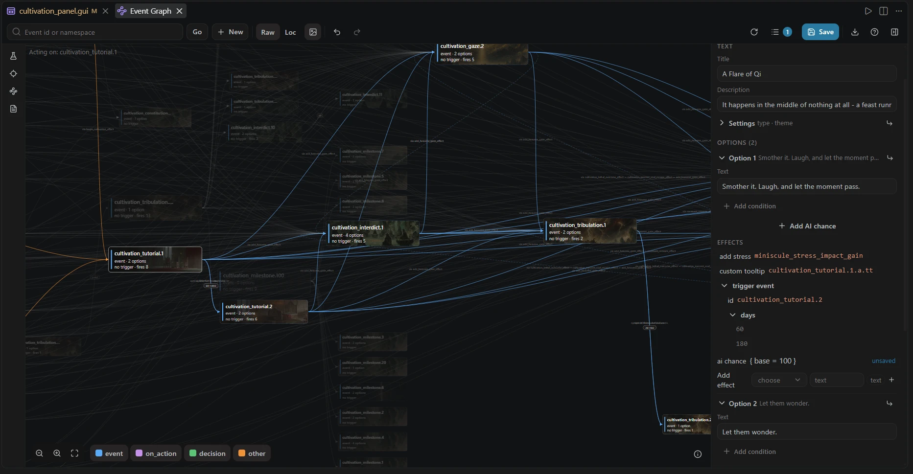
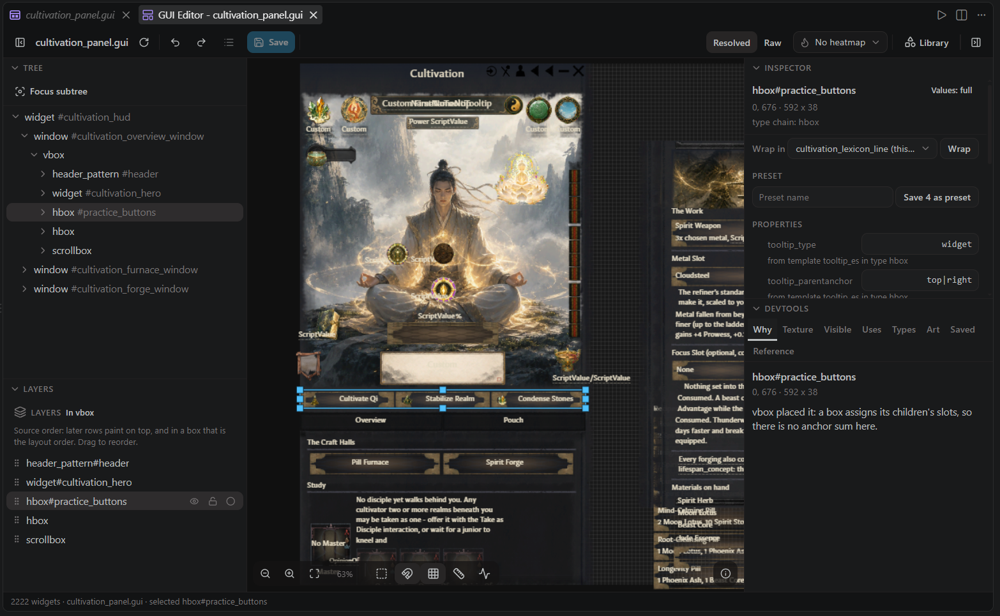
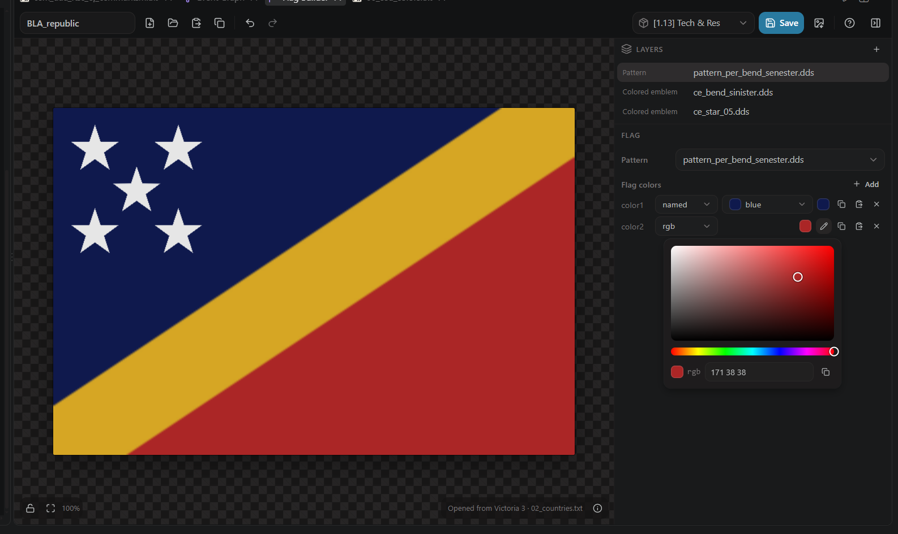

<div align="center">



# Paradox Modding Toolkit

**A language workbench for Paradox mods.** Crusader Kings III, Victoria 3 and
Europa Universalis V: a real script parser, scope-aware completion, instant
diagnostics for the bugs the game swallows in silence, deep
[tiger](https://github.com/amtep/tiger) integration, a visual GUI editor, an
event graph laid out in firing order, a coat-of-arms Flag Builder, and a
localization workflow no other tool has.

[](LICENSE)

[](https://marketplace.visualstudio.com/items?itemName=JDeffner.px-toolkit)
[](https://www.npmjs.com/package/@px-lsp/server)


[Install](#install) · [What you get](#what-you-get) ·
[Outside VS Code](#not-just-vs-code) · [Repo layout](#repo-layout) ·
[Docs](https://github.com/JDeffner/paradox-modding-toolkit/wiki)

</div>

> **Beta (0.3.x).** Young project, useful day to day, rough edges included.
> Bug reports and missing-feature complaints are the point, not a nuisance:
> open an [issue](https://github.com/JDeffner/paradox-modding-toolkit/issues).

## Install

Search for **Paradox Modding Toolkit** in the VS Code Extensions view, or:

```
ext install JDeffner.px-toolkit
```

Then open your mod folder and run **Paradox: Run Setup & Health Check**. It
finds the game, checks the dump folder, and offers to download tiger. The
default amount of configuration is none. Full walkthrough:
[Getting Started](https://github.com/JDeffner/paradox-modding-toolkit/wiki/Getting-Started).

## What you get



*The Project panel: the game is auto-detected, and every workspace mod carries
its own toggles for indexing and for which mod the views follow.*



*Simulate Event walks an event beside its source, with each option and the
effects it runs.*



*Select a card in the event graph: blue is what it fires, orange is what fires
it, and the inspector edits the event as words. The layout puts time on the x
axis, so left to right means "happens after".*



*The GUI editor draws your `.gui` file with a measured layout engine and lets
you work in it: tree, layers, canvas, inspector, element library.*



*The Flag Builder (Victoria 3, EU5) composes a coat of arms exactly as the
game recolors it, and saves it back as script.*

- **Completion that knows the grammar and the scope.** Key positions offer
  triggers and effects, value positions offer traits, events, on_actions and loc
  keys, and `scope:`, `culture:`, `title:` prefixes complete their referents.
  Items valid in the current scope rank first. Nothing is hidden.
- **Diagnostics for the silent-failure class.** Unbalanced braces, a missing
  UTF-8 BOM, a loc header that disagrees with its filename, `localisation/`
  instead of `localization/`, references to events that do not exist. These are
  the bugs that make the game ignore your file without a word.
- **tiger, integrated.** Auto-download of ck3-tiger or vic3-tiger, reports as
  native Problems, dependency mods passed through as `load_mod`, and a baseline
  workflow so a legacy mod shows only new findings.
- **A visual GUI editor** (CK3, Vic3). A pixel-accurate rendering of your
  window that you can work in: click to select, drag, resize, edit properties,
  insert from a library where every element previews as the game draws it.
  Every change is a surgical text edit, and the editor refuses gestures the
  engine would ignore instead of writing a line the game drops.
- **A Flag Builder** (Vic3, EU5). Compose coats of arms from the game's and
  your mods' patterns and emblems, drag them on the canvas, and save script.
- **Event tooling.** An event graph whose x axis is time, with a structured
  inspector that edits events as words rather than script; a simulator that
  walks a whole chain; and a mod report you can read top to bottom.
- **Localization that keeps up.** Inline loc as inlay hints, BOM-correct
  editing, a coverage view, and scaffolding for entire translation mods.
- **DDS tooling.** Inline texture previews on hover, a zoomable viewer with
  PNG export, image-to-DDS conversion, and measured size guidelines.
- **Large workspaces are the design case.** A game install plus five Workshop
  mods, all indexed, opens in 61 s cold where it used to take 143, and one
  command stops VS Code itself crawling the game's textures and audio.

The full tour with screenshots is the
[Feature Overview](https://github.com/JDeffner/paradox-modding-toolkit/wiki/Feature-Overview).

## Which games

| | Crusader Kings III | Victoria 3 | Europa Universalis V |
|---|---|---|---|
| Language support | full | full | full |
| Folder schema | verified against a live install | verified against a live install | community-sourced, **not yet verified** |
| Deep validation | ck3-tiger | vic3-tiger | none exists yet |
| Visual GUI editor | yes | yes | no |
| Flag Builder | no | yes | yes |

CK3 is where the toolkit grew up and where every feature exists. The exact
per-game limits, the detection ladder and the EU5 honesty note are on
[Supported Games](https://github.com/JDeffner/paradox-modding-toolkit/wiki/Supported-Games).

## Not just VS Code

The language server is standard LSP over `--stdio` and runs from neovim, Zed,
Helix or your own application. It is on npm:

```bash
npm install -g @px-lsp/server
px-lsp                       # stdio is the default transport
```

The [releases](https://github.com/JDeffner/paradox-modding-toolkit/releases)
page carries the same payload for people who would rather not use npm:
`px-lsp-server-<version>.tar.gz`, or `px-lsp-win-x64-<version>.zip` for one
download that already contains Node and a launcher.

- [`packages/server/README.md`](packages/server/README.md) covers standalone
  setup and the per-language capability table.
- [`docs/EMBEDDING.md`](docs/EMBEDDING.md) covers embedding the server in your
  own application: the process contract, initialization options and the
  `paradox/*` methods beyond standard LSP.
- [`docs/PROTOCOL.md`](docs/PROTOCOL.md) is the method-by-method wire reference.

## Repo layout

pnpm monorepo. The extension is a thin client; all parsing and analysis lives in
a separate server process, and everything game-specific sits behind one
`GameProfile` boundary that CI enforces.

| Package | |
|---|---|
| [`packages/vscode`](packages/vscode) | The **Paradox Modding Toolkit** extension, the primary client. Its [README](packages/vscode/README.md) is the user-facing one. |
| [`packages/server`](packages/server) | [`@px-lsp/server`](https://www.npmjs.com/package/@px-lsp/server) on npm: parser, index, scope engine, features, per-game profiles, bundled data. Speaks node-ipc and `--stdio`. |
| [`packages/protocol`](packages/protocol) | [`@px-lsp/protocol`](https://www.npmjs.com/package/@px-lsp/protocol) on npm: the wire contract and the helpers shared between server and clients. |

## Development

```bash
pnpm install
pnpm run compile     # esbuild bundles dist/extension.js (client) + dist/server.js
pnpm run typecheck
pnpm test            # vitest
```

Corpus-gated tests and dev scripts read machine paths from `dev-paths.json`
(copy `dev-paths.example.json`). Architecture, conventions and the release
recipe are in [`AGENTS.md`](AGENTS.md). Working with a total conversion or a
dozen mods at once? [`docs/PERFORMANCE.md`](docs/PERFORMANCE.md) has the
measured costs and the settings that shrink them.

## Contributing

Concrete examples from real mods are the most useful thing you can send.

- **[Issues](https://github.com/JDeffner/paradox-modding-toolkit/issues)** for
  bugs, false diagnostics and feature ideas. Wrong or missing folder mappings,
  especially for EU5, have their own "Schema gap" form.
- **Pull requests are welcome.** The per-game schema tables
  (`packages/server/src/games/<game>/schema.ts`) are deliberately small and
  community-editable, so adding a folder kind is a good first contribution.
- **Fork it and take what is useful.** It is GPL-3.0-or-later, so keep
  distributed derivatives open.

## License

GPL-3.0-or-later, see [LICENSE](LICENSE). Bundled third-party data keeps its own
terms: the CK3 wiki token lists are CC BY-SA 3.0
([ATTRIBUTION.md](packages/server/data/ck3/wikidocs/ATTRIBUTION.md)) and the EU5
schema import is MIT
([THIRD-PARTY-NOTICES.md](THIRD-PARTY-NOTICES.md)). No game assets are
redistributed.
