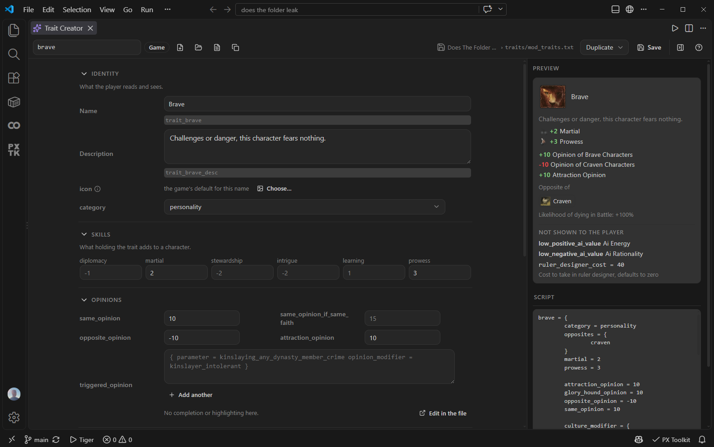

# Paradox Modding Toolkit

Write, check and build mods for **Crusader Kings III**, **Victoria 3** and **Europa Universalis V** in VS Code.

[](LICENSE)


[](https://discord.gg/DfEJ2H9hj4)

## Start editing

1. Install **Paradox Modding Toolkit** (`JDeffner.px-toolkit`), then open your mod folder or run **Paradox: New Mod**.
2. Run **Paradox: Run Setup & Health Check**. Check the detected game, mod and data paths. CK3 and Victoria 3 include vocabulary snapshots; EU5 needs your own `script_docs` dump.
3. Open a script file. Completion offers engine words and indexed definitions; hover explains the word under the cursor. The Project panel opens the visual tools, validation and publishing commands.

New to modding? Follow [Your first CK3 mod](https://github.com/JDeffner/paradox-modding-toolkit/wiki/First-Mod). For an existing project, use [Getting Started](https://github.com/JDeffner/paradox-modding-toolkit/wiki/Getting-Started). If setup does not work, start with [Troubleshooting](https://github.com/JDeffner/paradox-modding-toolkit/wiki/Troubleshooting).

This is a beta. Check generated content in the game before publishing it. After game patches, regenerate your dumps to match the installed version.

## At the cursor

- **Completion and navigation:** scope-aware ranking, definitions, references, rename, symbols and block skeletons. Items outside the inferred scope are annotated rather than hidden.
- **Documentation from the game:** hover descriptions, scope information, localized text and texture previews, plus searchable vanilla examples.
- **Graphics assets:** CK3 and Victoria 3 `.asset` indexing, context-specific completion, reference navigation and DDS previews. Use `px.indexAssets` to toggle scanning.
- **Section folding:** `### Title` or longer hash headings fold through the next heading or the end of the file, across closing braces.
- **Validation:** instant structural checks for malformed files, encodings and folder mistakes. CK3 and Victoria 3 also integrate tiger for deeper validation.
- **Localization:** coverage, inlay hints, quick fixes and workflows for adding languages or making a translation mod.

## Build and inspect content

The **Event Simulator** walks an event and its options beside the source. The **Event Graph** follows firing chains and lets you edit event content. Both are static tools; they do not execute the game.


The **GUI Editor** lets you select, move and resize widgets, inspect inherited properties and save source-preserving edits. Its preview models supported layout rules; runtime bindings still need an in-game check. CK3 also has forms for traits, cultures, traditions, legacies, dynasties and coats of arms. Victoria 3 and EU5 have the Flag Builder.



The **Dynasty Tree** supports copying DNA for mod files or the game, including lookup in dependency mods and pasting portrait-editor DNA.

The Project panel also opens DDS conversion, game launch options, custom calendars, multi-mod indexing and the **Steam Workshop Panel**. Workshop uploads use your running Steam client and show the parts being uploaded before confirmation.

## Choose your workflow

| Task | Guide |
|---|---|
| Create a mod and test it in CK3 | [First Mod](https://github.com/JDeffner/paradox-modding-toolkit/wiki/First-Mod) |
| Work on a submod, total conversion or translation | [Multi Mod and Translation](https://github.com/JDeffner/paradox-modding-toolkit/wiki/Multi-Mod-and-Translation) |
| Design content or interfaces | [Content Creators](https://github.com/JDeffner/paradox-modding-toolkit/wiki/Content-Creators), [GUI Editor](https://github.com/JDeffner/paradox-modding-toolkit/wiki/GUI-Editor) |
| Publish or update a mod | [Steam Workshop](https://github.com/JDeffner/paradox-modding-toolkit/wiki/Steam-Workshop) |
| Tune settings or diagnose a problem | [Configuration](https://github.com/JDeffner/paradox-modding-toolkit/wiki/Configuration), [Troubleshooting](https://github.com/JDeffner/paradox-modding-toolkit/wiki/Troubleshooting) |

## Game and client support

| Feature | CK3 | Victoria 3 | EU5 |
|---|---|---|---|
| Script language core | Yes | Yes | Yes; own engine dump needed |
| Tiger validation | Yes | Yes | No |
| Visual GUI editor | Yes | Yes | No |
| CK3 content creators | Yes | No | No |
| Coat-of-arms editor | Designer | Flag Builder | Flag Builder |

EU5's schema is community-sourced and has not been verified against a live install. Read [Supported Games](https://github.com/JDeffner/paradox-modding-toolkit/wiki/Supported-Games) for the full matrix and dump commands, and [Platform Support](https://github.com/JDeffner/paradox-modding-toolkit/wiki/Platform-Support) for local, remote and non-Steam setups.

The standalone language server is available as `@px-lsp/server`, with a tested [Neovim setup](https://github.com/JDeffner/paradox-modding-toolkit/wiki/Outside-VS-Code). Zed and Helix integrations are currently unverified. Application authors can use the [Embedding guide](https://github.com/JDeffner/paradox-modding-toolkit/wiki/Embedding), including the browser library. Tiger and the visual tools remain VS Code features.

AI-agent modding skills live in the separate [paradox-ai-modding](https://github.com/JDeffner/paradox-ai-modding) project.

## Contributing & feedback

This is a beta shaped by the people who use it. The best thing you can do is
tell me what breaks and what is missing:

- **File an [issue](https://github.com/JDeffner/paradox-modding-toolkit/issues)** for
  bugs, false diagnostics, or feature ideas. Concrete examples from real mods
  are gold. Wrong or missing folder mappings, especially for EU5, have their
  own "Schema gap" issue form.
- **PRs are welcome.** The per-game schema tables
  (`packages/server/src/games/<game>/schema.ts`) are deliberately small and
  community-editable: adding a folder kind or loc requirement is a good first
  contribution.
- **Fork it and take inspiration.** If a piece of this is useful in your own
  tooling, use it. It is GPL-3.0-or-later, so keep distributed derivatives open.
- **[Join the Discord](https://discord.gg/DfEJ2H9hj4)** for release notes,
  quick questions and modding help. The extension links to it from the bottom
  of the Project panel and from `Paradox: Join the Discord`.

### Dev quickstart

```
pnpm install
pnpm run compile      # esbuild bundles dist/extension.js (client) + dist/server.js
pnpm run typecheck
pnpm test             # vitest; copy dev-paths.example.json to dev-paths.json to also run the vanilla corpus suites
```

Layout (pnpm monorepo): `packages/vscode/` (this extension) ·
`packages/server/` (language server: parser, index, scopes, features, per-game
profiles, bundled data) · `packages/protocol/` (types, wire protocol, shared
helpers) · `packages/*/test/` (vitest suites incl. corpus/fixture tests). The extension is a
client/server LSP split: the thin client runs in the extension host, all parsing
and analysis lives in a separate server process. Everything game-specific sits
behind one `GameProfile` boundary that CI enforces. The architecture map and
conventions are in [`AGENTS.md`](https://github.com/JDeffner/paradox-modding-toolkit/blob/main/AGENTS.md).

## Acknowledgements

The extension stands on work by others. The key sources and inspirations:

- [tiger](https://github.com/amtep/tiger) by amtep, the validator behind the
  ck3-tiger and vic3-tiger diagnostics integration.
- [cwtools](https://github.com/cwtools/cwtools) and cwtools-vscode, for the
  landscape and design inspiration.
- [kaiser-chris/cwtools-eu5-config](https://github.com/kaiser-chris/cwtools-eu5-config),
  the source of the EU5 folder schema (MIT, pinned commit; the Victoria 3
  equivalent was used as a cross-check only). Full notices in
  [THIRD-PARTY-NOTICES.md](https://github.com/JDeffner/paradox-modding-toolkit/blob/main/THIRD-PARTY-NOTICES.md).
- [jesec/ck3-modding-wiki](https://github.com/jesec/ck3-modding-wiki), the source
  of the bundled CK3 fallback token lists (CC BY-SA 3.0, see
  [ATTRIBUTION.md](https://github.com/JDeffner/paradox-modding-toolkit/blob/main/packages/server/data/ck3/wikidocs/ATTRIBUTION.md)).
- Paradox's own in-game `_*.info` format docs, the primary ground truth for the
  CK3 schema layers. No game assets are redistributed.

The complete table with licenses is on the
[Credits wiki page](https://github.com/JDeffner/paradox-modding-toolkit/wiki/Credits).

## License

GPL-3.0-or-later. In short: use, modify and redistribute freely, but any
distributed fork or derivative must publish its source under the GPL too. See
[LICENSE](LICENSE). Bundled third-party data keeps its own terms (the CK3 wiki
token lists are CC BY-SA, see [ATTRIBUTION.md](https://github.com/JDeffner/paradox-modding-toolkit/blob/main/packages/server/data/ck3/wikidocs/ATTRIBUTION.md);
the EU5 schema import is MIT, see [THIRD-PARTY-NOTICES.md](https://github.com/JDeffner/paradox-modding-toolkit/blob/main/THIRD-PARTY-NOTICES.md)).
