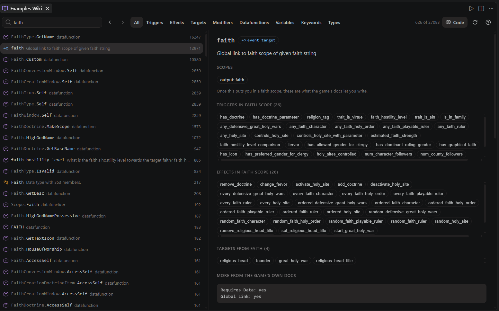
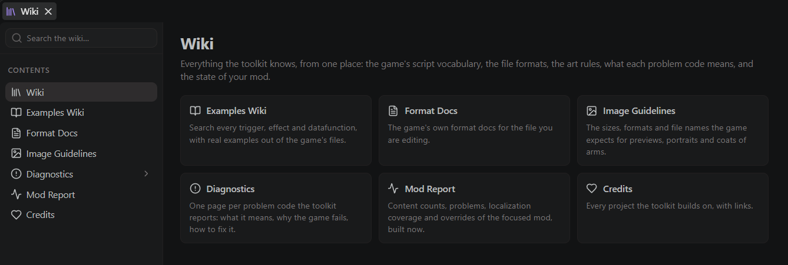

<div align="center">


# Paradox Modding Toolkit for VS Code

Mod development for **Crusader Kings III**, **Victoria 3** and **Europa
Universalis V**: a language server with a real Paradox-script parser,
scope-aware completion, instant diagnostics for the silent-failure class of
bugs, deep [tiger](https://github.com/amtep/tiger) integration, a live mod
overview, and a localization workflow no other tool has.

[](LICENSE)


[](https://discord.gg/DfEJ2H9hj4)

</div>

> **Beta (0.3.x).** This is a young project and things will change. It is
> already useful day to day, but you will hit rough edges. Feedback is not just
> welcome, it is the point: see [Contributing](#contributing--feedback) below.

CK3 is the game this toolkit grew up on and is where every feature exists. The
other two get the same language core; [Game support](#game-support) at the
bottom says exactly where they stop.

## Highlights

- **Scope-aware completion**: key positions offer verbs (triggers/effects),
  value positions offer nouns (traits, events, on_actions, loc keys), and
  `scope:`, `culture:`, `title:` prefixes complete their referents. Items valid
  in the current scope rank first; others are annotated, never hidden.
- **Hover docs with texture previews**: merged `script_docs` and (on CK3) wiki
  docs, the live scope chain at the cursor, resolved loc text, and inline
  `.dds` image previews from a pure-TS DDS decoder.
- **Structural diagnostics** for the bugs the game swallows silently: unbalanced
  braces, missing UTF-8 BOM, loc header/filename mismatches, folder traps
  (`localisation/`, plural `on_actions`), references to events that do not exist.
- **Deep tiger integration**: auto-download of ck3-tiger or vic3-tiger, run on
  save or manually, JSON reports as native Problems, and a baseline workflow to
  adopt tiger on a legacy mod (suppress today's reports, see only new ones).
  Dependency mods (`px.parentMods` and the other workspace mods) are passed to
  tiger as `load_mod` entries, so a submod's references into its parents
  resolve instead of coming back "unknown" — automatic when the mod has no
  tiger conf of its own, and written into the conf **Generate ck3-tiger.conf**
  creates. EU5 has no tiger build, so the toolkit says so instead of
  pretending.
- **Sidebar**: mod overview, localization coverage, overrides and conflicts
  (with the LIOS/FIOS winner), a GUI widget tree (Ctrl+Alt+W) and a mod report
  (Ctrl+Alt+R).
- **Event graph** (Ctrl+Alt+G): events, on_actions and decisions drawn with
  time on the x axis, so left to right means "happens after". Cards grow a row
  per phase, chains focus to an adjustable depth, and the inspector edits the
  event as words rather than script, saving all pending edits in one go.
- **The Project panel is the home of every tool**: each one has a row there, so
  you never have to remember which tab or status bar item hides the button.
  Editor buttons and the chords stay as the fast path while you work: the
  game's own `_*.info` format docs for the file you are editing, for one, are
  **Open Format Docs** or Ctrl+Alt+D. Rows you
  never use go away with **Customize Project Panel Rows**, and the panel's
  keyboard icon opens the Keyboard Shortcuts UI filtered to this extension, so
  every chord below is rebindable in two clicks.
- **Event simulator** (**Simulate Event**, Ctrl+Alt+S): a static walkthrough of what happens
  when an event fires (trigger, immediate, each option with its localized text,
  after) where every onward `trigger_event` is a step-into link, so you can
  walk a whole chain with a breadcrumb and a Back button. It reads each game's
  own event vocabulary, so a Victoria 3 event shows its `flavor` line and its
  `cancellation_trigger` in place.
- **Color picker**: a swatch on every `rgb { }`, `hsv { }`, `hsv360 { }`,
  `hex { }` and `color = { }` value, in script and `.gui`. Click it for the
  native picker; click the label to cycle between the formats.
- **DDS and images**: zoomable `.dds` preview, a PNG/JPEG/WebP to DDS converter
  in the explorer right-click menu, and **Show Image Guidelines** with the
  sizes vanilla actually uses.
- **Localization workflow**: inline loc as inlay hints, BOM-correct quick-fix
  editing, a coverage view, and scaffolds for whole translation mods.
- **Custom calendars**: total-conversion mods declare their era system once
  (`px.calendar`, with custom month names and lengths if the mod has them)
  and every script date shows its in-game form: `3000.1.1` reads `1000 BC`
  as an inlay hint and on hover, and **Insert Date** converts "1000 BC
  March 15" into the `3000.3.15` the game logic needs.
- **Content scaffolds**: **New Content** generates events, decisions,
  interactions and on_action hooks that are correct by construction.
- **Live debugging**: **Launch Game (debug mode)** plus a **Toggle
  error.log Watcher** that surfaces in-game script errors as editor squiggles.
- **Steam Workshop publishing**: upload through your running Steam client,
  no Paradox launcher and no password. New items start private, the
  changenote is prefilled from your changelog or last commit, and the
  Workshop id lands in `descriptor.mod` where the game expects it. The
  **Steam Workshop Panel** manages the item itself: description (BBCode, with
  a rendered preview and `.bbcode` syntax highlighting), visibility, tags,
  preview image, versions, translated titles and descriptions per Steam
  language, live statistics, and confirmed selective uploads (details without
  re-uploading content). The whole listing can live as diffable files in a
  `workshop` folder next to the mod, one download button away, with
  changenotes read from your changelog by version.
- **GUI and data types** in `.gui` files: completion, hover, widget tree, and
  `[Character.GetFather...]` data-type chains that resolve through return types.
- **GUI editor** (**Open GUI Editor**, Ctrl+Alt+P): a pixel-accurate rendering
  of your window that you can work in. Click to select the widget you meant,
  read its properties with the template or type each one came from, drag and
  resize on the canvas, and edit, add or remove a property row. Every change is
  one surgical edit to your file (comments, tabs and single-line bodies
  survive), and one Ctrl+Z. When the engine would ignore what a gesture asks
  for, the editor says so before the widget moves instead of writing a line the
  game drops. CK3 and Victoria 3; the layout engine was calibrated against
  in-game screenshots.
- **Flag Builder** (**Open Flag Builder**, Victoria 3 and EU5): compose a coat
  of arms from the game's and your mods' patterns and emblems, recolored
  exactly as the game does it, drag and scale emblems on the canvas, and save
  it back as script into the mod you choose.
- **Multi-mod workspaces**: every workspace mod is a first-class mod, indexed
  together, with per-mod tiger baselines and no "primary mod" to configure.
- **Built for the big workspaces**: a game install plus five Workshop mods,
  all indexed, opens in 61 s from a cold disk where it used to take 143, and
  the server holds 1.5 GB instead of 1.7. `Paradox: Reduce VS Code Indexing
  Load` also stops VS Code's own search and watcher crawling 43,000 texture
  and audio files, which turns a whole-workspace Find in Files from up to
  106 s into under a second. `px.excludedMods` drops a mod you are not
  editing; read-only context keeps its definitions without the reference
  index. Numbers and method in
  [PERFORMANCE.md](https://github.com/JDeffner/paradox-modding-toolkit/blob/main/docs/PERFORMANCE.md).
- **The workspace looks like the game you mod**: script files carry a per-game
  file icon (the crown for Crusader Kings III, the PX box for the others) and
  the status bar names the game, e.g. "Paradox Script (Victoria 3)". Snippets
  follow the same line, so CK3 effects stay out of a Victoria 3 file.
- **A [Claude/agent skill for CK3 modding](https://github.com/JDeffner/paradox-modding-toolkit/wiki/Claude-Skill)**
  ships in `skills/ck3-modding/` for AI-assisted modding.
- **Not tied to VS Code**: the language server is standard LSP over `--stdio`
  and runs from neovim, Zed, Helix or your own application — see
  [Outside VS Code](#outside-vs-code).

## A quick look


*The Project panel: the game is auto-detected, and every workspace mod has its
own toggles for what gets indexed and which mod the views follow.*


*Simulate Event walks an event beside its source, options and the effects they
run included.*


*Select a card in the event graph: blue is what it fires, orange is what fires
it, and left to right means "happens after".*



*The Examples Wiki searches every trigger, effect and scope the game reported
about itself, ranked by real usage count.*



*The wiki hub collects the reference views on one page: Examples Wiki, format
docs, image guidelines, diagnostics, mod report and credits.*

## Quick start

1. Install the extension, open your mod folder, and run **Run Setup & Health
   Check**. It detects the game, finds the install via Steam, checks the
   dump folder, and offers to download tiger where one exists. The walkthrough
   covers the rest.
2. *(Recommended on CK3, essential on Vic3 and EU5)* Launch the game with
   `-debug_mode`, open the console (\`), run `script_docs`, then run **Reload
   Game Data (script_docs)**. On CK3 this upgrades the token data from
   the bundled wiki lists to your exact game version; on the other two it is
   where the engine vocabulary comes from in the first place. EU5 writes its
   dumps to `Documents/Paradox Interactive/Europa Universalis V/docs`, not to
   `logs/`.

The default configuration is nothing: open your mod folder(s), run Setup once,
and everything else is optional. `px.gamePath`, `px.logsPath` and
`px.tigerPath` describe whichever game is active and are honored whenever you
set them; leave them empty and each game is detected on its own. Full
walkthrough and every setting are in the wiki:
**[Getting Started](https://github.com/JDeffner/paradox-modding-toolkit/wiki/Getting-Started)**
and **[Configuration](https://github.com/JDeffner/paradox-modding-toolkit/wiki/Configuration)**.

## Documentation

The full docs live in the
[wiki](https://github.com/JDeffner/paradox-modding-toolkit/wiki):

- [Home](https://github.com/JDeffner/paradox-modding-toolkit/wiki/Home)
- [Feature Overview](https://github.com/JDeffner/paradox-modding-toolkit/wiki/Feature-Overview)
- [Getting Started](https://github.com/JDeffner/paradox-modding-toolkit/wiki/Getting-Started)
- [Supported Games](https://github.com/JDeffner/paradox-modding-toolkit/wiki/Supported-Games)
- [Editor Features](https://github.com/JDeffner/paradox-modding-toolkit/wiki/Editor-Features)
- [Sidebar Views](https://github.com/JDeffner/paradox-modding-toolkit/wiki/Sidebar-Views)
- [GUI Editor](https://github.com/JDeffner/paradox-modding-toolkit/wiki/GUI-Editor)
- [DDS and Images](https://github.com/JDeffner/paradox-modding-toolkit/wiki/DDS-and-Images)
- [Configuration](https://github.com/JDeffner/paradox-modding-toolkit/wiki/Configuration)
- [Multi-Mod and Translation](https://github.com/JDeffner/paradox-modding-toolkit/wiki/Multi-Mod-and-Translation)
- [Claude Skill](https://github.com/JDeffner/paradox-modding-toolkit/wiki/Claude-Skill)
- [Credits](https://github.com/JDeffner/paradox-modding-toolkit/wiki/Credits)

Working in a workspace with a total conversion or a dozen mods?
[`docs/PERFORMANCE.md`](https://github.com/JDeffner/paradox-modding-toolkit/blob/main/docs/PERFORMANCE.md)
has the measured costs and the settings that shrink them.

## Outside VS Code

The language server runs standalone over `--stdio` from any LSP client
(neovim, Zed, Helix, ...). Grab `px-lsp-server-<version>.tar.gz` from the
[releases](https://github.com/JDeffner/paradox-modding-toolkit/releases), or
`px-lsp-win-x64-<version>.zip` if you want one download that already contains
Node and a `px-lsp.cmd` launcher; setup,
the per-language capability table and the per-game matrix are in
[`packages/server/README.md`](https://github.com/JDeffner/paradox-modding-toolkit/blob/main/packages/server/README.md).

Embedding the server in your own application (a mod manager, a custom editor)
is a supported, documented path:
[`docs/EMBEDDING.md`](https://github.com/JDeffner/paradox-modding-toolkit/blob/main/docs/EMBEDDING.md)
covers the process contract, initialization options, and the `paradox/*` wire
methods beyond standard LSP (event graph, mod overview, GUI layout, scope
inference), with [`docs/PROTOCOL.md`](https://github.com/JDeffner/paradox-modding-toolkit/blob/main/docs/PROTOCOL.md)
as the method-by-method reference.

## Game support

Every game gets the same language core. This table is where the differences
live, and it is deliberately blunt about them.

| | Crusader Kings III | Victoria 3 | Europa Universalis V |
|---|---|---|---|
| Language support (completion, hover, navigation, references, rename, diagnostics) | full | full | full |
| Folder schema | 156 entries, verified against a live install | 83 entries, verified against a live install | 518 entries, **community-sourced and not yet verified against a live install** |
| Engine vocabulary before you dump `script_docs` | bundled wiki + dump snapshot | bundled dump snapshot | none yet |
| Deep validation | ck3-tiger, auto-download | vic3-tiger, auto-download | none exists yet |
| error.log watcher (in-game errors as squiggles) | yes | yes | expected to work; path and line format not yet verified on a live install |
| Sidebar views, event graph, event simulator, mod report, coverage | yes | yes | yes |
| `.gui` language support and Widget Tree | yes | yes | yes |
| `.gui` pixel-accurate visual editor (drag, resize, inspector writes) | yes | yes (measured in-game 2026-08) | no (not calibrated yet) |
| Bundled AI modding skill | yes | no (CK3 content) | no (CK3 content) |
| Mod descriptor | `descriptor.mod` | `.metadata/metadata.json` | `.metadata/metadata.json` |

**Existing CK3 users need to change nothing.** `px.gameId` defaults to `auto`
and the detection ladder ends in CK3: a mod folder with a `descriptor.mod` is
CK3, a folder with `.metadata/` plus `in_game/`-style stage folders is EU5,
`.metadata/` alone is Victoria 3, and anything else stays CK3. Set `px.gameId`
explicitly if that ever guesses wrong.

**First run on Vic3 or EU5:** dump your own game data before judging the
completion. Launch with `-debug_mode`, run `script_docs` in the console, then
run **Reload Game Data (script_docs)** from the command palette. Only CK3
ships bundled wiki tables to fall back on, so for the other two this is the
step that fills in effects, triggers, event targets and modifiers. **Run Setup
& Health Check** puts it at the top of the report when it is missing. Vic3 and
EU5 write their dumps to `Documents/.../<game>/docs`, not to `logs/`.

**EU5 honesty note:** the EU5 folder-to-definition table is imported from the
community [cwtools-eu5-config](https://github.com/kaiser-chris/cwtools-eu5-config)
rules (MIT, pinned commit) and has not been checked against a live install. The
damage a wrong entry can do is bounded on purpose: a minimal hand-verified set
of reference fields and **zero** required-localization patterns, so a mistake
costs you navigation, never a false error squiggle. Gaps are fixable without
waiting for a release through the `<mod>/.px-toolkit/schema.json` overlay, and
reports are very welcome.

The same table with the detection ladder, the per-game dump paths and the
schema-overlay recipe is on the
[Supported Games](https://github.com/JDeffner/paradox-modding-toolkit/wiki/Supported-Games)
wiki page.

## Contributing & feedback

This is a beta shaped by the people who use it. The best thing you can do is
tell me what breaks and what is missing:

- **File an [issue](https://github.com/JDeffner/paradox-modding-toolkit/issues)** for
  bugs, false diagnostics, or feature ideas. Concrete examples from real mods
  are gold. Wrong or missing folder mappings, especially for EU5, have their
  own "Schema gap" issue form.
- **PRs are welcome.** The per-game schema tables
  (`packages/server/src/games/<game>/schema.ts`) are deliberately small and
  community-editable: adding a folder kind or loc requirement is a good first
  contribution.
- **Fork it and take inspiration.** If a piece of this is useful in your own
  tooling, use it. It is GPL-3.0-or-later, so keep distributed derivatives open.
- **[Join the Discord](https://discord.gg/ESstwqycug)** for release notes,
  quick questions and modding help. The extension links to it from the bottom
  of the Project panel and from `Paradox: Join the Discord`.

### Dev quickstart

```
pnpm install
pnpm run compile      # esbuild bundles dist/extension.js (client) + dist/server.js
pnpm run typecheck
pnpm test             # vitest; copy dev-paths.example.json to dev-paths.json to also run the vanilla corpus suites
```

Layout (pnpm monorepo): `packages/vscode/` (this extension) ·
`packages/server/` (language server: parser, index, scopes, features, per-game
profiles, bundled data) · `packages/protocol/` (types, wire protocol, shared
helpers) · `packages/*/test/` (vitest suites incl. corpus/fixture tests). The extension is a
client/server LSP split: the thin client runs in the extension host, all parsing
and analysis lives in a separate server process. Everything game-specific sits
behind one `GameProfile` boundary that CI enforces. The architecture map and
conventions are in [`AGENTS.md`](https://github.com/JDeffner/paradox-modding-toolkit/blob/main/AGENTS.md).

## Acknowledgements

The extension stands on work by others. The key sources and inspirations:

- [tiger](https://github.com/amtep/tiger) by amtep, the validator behind the
  ck3-tiger and vic3-tiger diagnostics integration.
- [cwtools](https://github.com/cwtools/cwtools) and cwtools-vscode, for the
  landscape and design inspiration.
- [kaiser-chris/cwtools-eu5-config](https://github.com/kaiser-chris/cwtools-eu5-config),
  the source of the EU5 folder schema (MIT, pinned commit; the Victoria 3
  equivalent was used as a cross-check only). Full notices in
  [THIRD-PARTY-NOTICES.md](https://github.com/JDeffner/paradox-modding-toolkit/blob/main/THIRD-PARTY-NOTICES.md).
- [jesec/ck3-modding-wiki](https://github.com/jesec/ck3-modding-wiki), the source
  of the bundled CK3 fallback token lists (CC BY-SA 3.0, see
  [ATTRIBUTION.md](https://github.com/JDeffner/paradox-modding-toolkit/blob/main/packages/server/data/ck3/wikidocs/ATTRIBUTION.md)).
- Paradox's own in-game `_*.info` format docs, the primary ground truth for the
  CK3 schema layers. No game assets are redistributed.

The complete table with licenses is on the
[Credits wiki page](https://github.com/JDeffner/paradox-modding-toolkit/wiki/Credits).

## License

GPL-3.0-or-later. In short: use, modify and redistribute freely, but any
distributed fork or derivative must publish its source under the GPL too. See
[LICENSE](LICENSE). Bundled third-party data keeps its own terms (the CK3 wiki
token lists are CC BY-SA, see [ATTRIBUTION.md](https://github.com/JDeffner/paradox-modding-toolkit/blob/main/packages/server/data/ck3/wikidocs/ATTRIBUTION.md);
the EU5 schema import is MIT, see [THIRD-PARTY-NOTICES.md](https://github.com/JDeffner/paradox-modding-toolkit/blob/main/THIRD-PARTY-NOTICES.md)).
